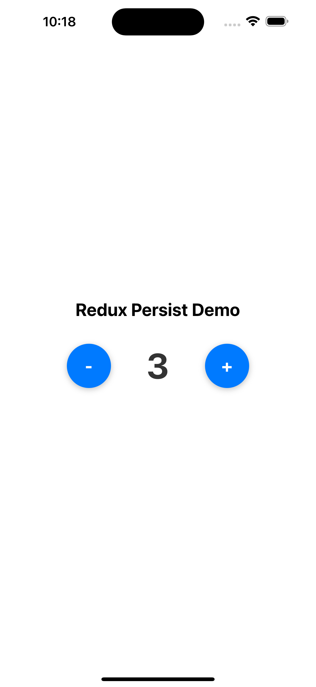

|이미지|영상|
|-|-|
| |[]("./images/redux-persist-1.mp4")|


# Redux & Redux Persist Demo 📱

> React Native, Redux 및 Redux Persist 학습
- Expo + Redux Toolkit + Redux Persist

## 🎯 프로젝트 목적

- **Redux Toolkit**의 현대적 사용법 학습
- **Redux Persist**를 통한 상태 영속화 구현
- **PersistGate**의 역할과 중요성 이해
- React Native에서의 상태 관리 베스트 프랙티스 탐구

## 📖 학습 포인트

### 1. Redux Toolkit 기본 구조
```
src/store/
├── store.ts          # Store 설정 및 미들웨어
└── counterSlice.ts   # createSlice를 이용한 슬라이스
```

### 2. 주요 개념들

#### createSlice vs 기존 Redux
- **기존 방식**: Action Types → Action Creators → Reducer
- **createSlice**: 한 번에 모든 것을 정의 (Immer 내장으로 불변성 자동 관리)

#### Redux Persist 핵심
- **persistReducer**: 리듀서를 감싸서 저장/복원 기능 추가
- **PersistGate**: 상태 복원 완료까지 UI 렌더링 대기
- **AsyncStorage**: React Native에서 데이터 영속화

### 3. PersistGate의 중요성

#### PersistGate 있을 때
```typescript
<PersistGate loading={<LoadingComponent />} persistor={persistor}>
  <App />
</PersistGate>
```
- 상태 복원 완료 → UI 렌더링 (일관된 상태)

#### PersistGate 없을 때
- 초기값으로 UI 렌더링 → 복원된 값으로 변경

## 🔧 코드 하이라이트

### 1. Modern Redux Pattern (counterSlice.ts)
```typescript
export const counterSlice = createSlice({
  name: 'counter',
  initialState: { value: 0 },
  reducers: {
    increment: (state) => {
      state.value += 1; // Immer가 불변성 처리
    },
    decrement: (state) => {
      state.value -= 1;
    }
  }
});
```

### 2. 이벤트 중심 네이밍 (UI와 로직 분리)
```typescript
// ✅ UI 이벤트 기반
const { onPressPlus, onPressMinus } = useReduxPersistDemo();

// ❌ 비즈니스 로직 기반  
const { handleIncrement, handleDecrement } = useReduxPersistDemo();
```

### 3. 느린 네트워크 시뮬레이션
```typescript
const createSlowStorage = (delay: number = 2000) => ({
  getItem: async (key: string) => {
    await new Promise(resolve => setTimeout(resolve, delay));
    return AsyncStorage.getItem(key);
  }
});
```
---
